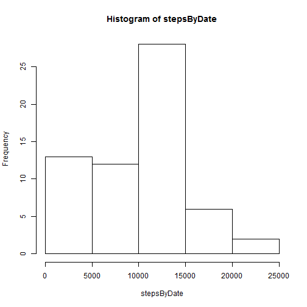
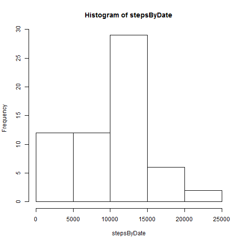
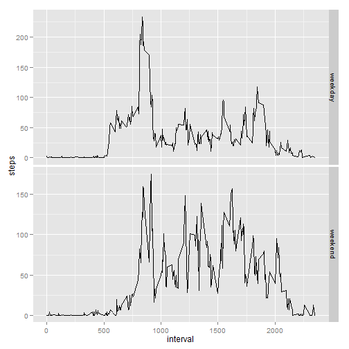

# Reproducible Research: Peer Assessment 1


## Loading and preprocessing the data

```r
actvtfile = "activity.csv"
unzip(zipfile = "activity.zip", files=actvtfile)
actvtRawData <- read.csv(file=actvtfile)
actvtData <- actvtRawData[!is.na(actvtRawData$steps),]
```

## What is mean total number of steps taken per day?

```r
xtabs(steps~date, actvtData)->stepsByDate
#aggregate(steps~date, data=actvtData, mean)->stepsByDate
hist(stepsByDate)
```

 

```r
mean(stepsByDate)
```

```
## [1] 9354
```

```r
median(stepsByDate)
```

```
## 2012-10-20 
##      10395
```

## What is the average daily activity pattern?


```r
require(ggplot2)
```

```
## Loading required package: ggplot2
```

```
## Warning: package 'ggplot2' was built under R version 3.0.3
```

```r
#tapply(actvtData$steps, INDEX=actvtData$interval, FUN=mean)->stepsByInterval
aggregate(steps~interval, data=actvtData, mean)->stepsByInterval

qplot(interval, steps, data=stepsByInterval, geom="line")
```

 

```r
#plot(names(stepsByInterval), stepsByInterval, type="l")
stepsByInterval[which.max(stepsByInterval$steps),c("interval")]
```

```
## [1] 835
```


## Imputing missing values

```r
# total number of missing values
sum(is.na(actvtRawData$steps))
```

```
## [1] 2304
```

```r
# fill in all of the missing data with the mean of same invertal
actvtFillData = actvtRawData
actvtFillData$steps = ifelse(is.na(actvtRawData$steps),stepsByInterval[stepsByInterval$interval==actvtRawData$interval,"steps"],actvtRawData$steps)

xtabs(steps~date, actvtFillData)->stepsByDate
#aggregate(steps~date, data=actvtData, mean)->stepsByDate
hist(stepsByDate)
```

 

```r
mean(stepsByDate)
```

```
## [1] 9531
```

```r
median(stepsByDate)
```

```
## 2012-11-05 
##      10439
```


## Are there differences in activity patterns between weekdays and weekends?

```r
require(ggplot2)
actvtData = actvtFillData
actvtData$dayinweek = ifelse(weekdays(as.Date(actvtData$date), abbreviate=TRUE) %in% c("周六", "周日"),"weekend","weekday")

aggregate(steps~interval+dayinweek, data=actvtData, mean)->stepsByIntervalAndweekend

qplot(interval, steps, data=stepsByIntervalAndweekend, geom="line") + facet_grid(dayinweek ~ ., scales="free_y")
```

 
